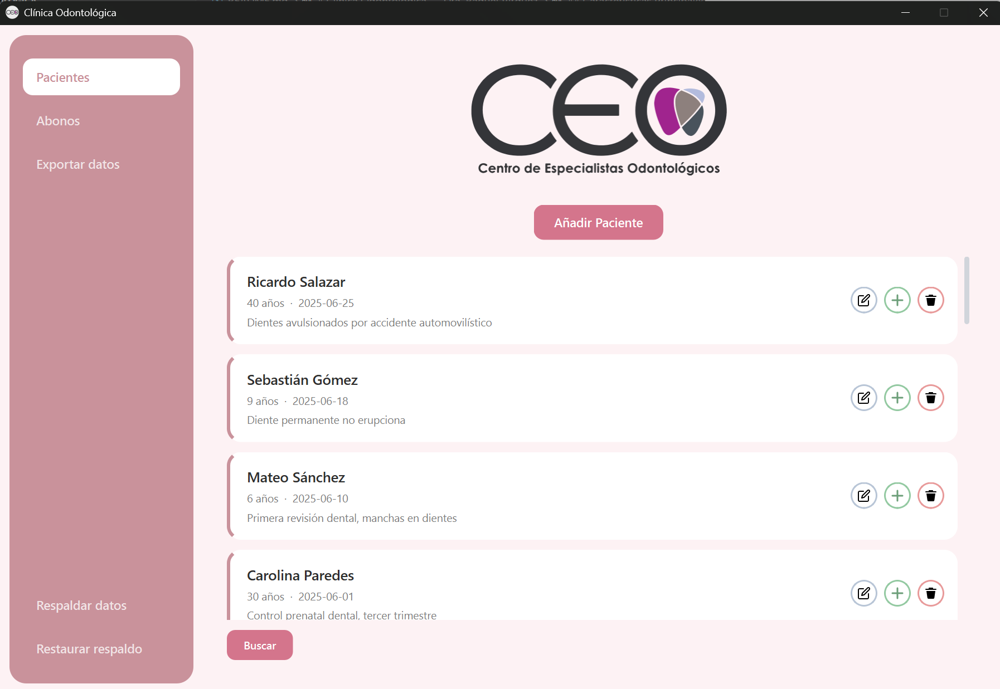
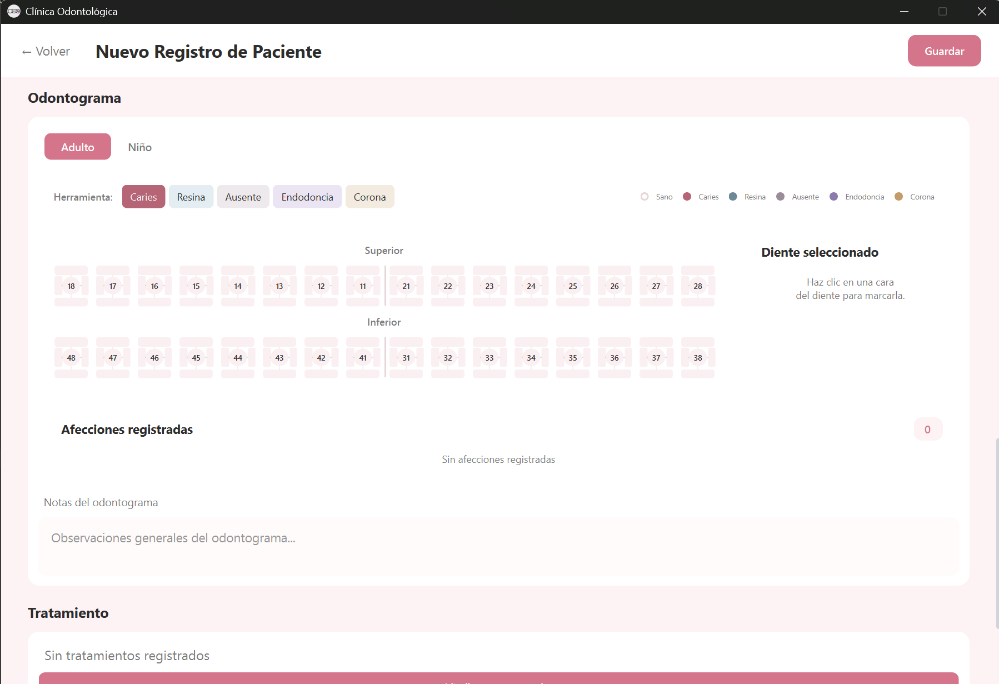

# Clínica Odontológica — Dra. Raquel Virguez


 Proyecto freelance de una aplicación de escritorio desarrollada a medida para la **Dra. Raquel Virguez**. 

 Permite la gestión clínica integral de pacientes, historial de tratamientos, control financiero con recálculo de saldos y registro de un odontograma digital.

---

## Imagenes 

| Panel Principal de Pacientes | Odontograma Interactivo (Adulto / Infantil) |
| :---: | :---: |
|  |  |
| *Gestión central de pacientes con búsqueda, edición y eliminación.* | *Modulo del odontograma con mapeo visual de 5 patologías en tiempo real.* |

---

## Características Principales

### 1. Odontograma Dinámico e interactivo

* **Soporte de edades infantiles y adultas:** Alternancia entre dientes permanentes y de leche.
* **Precisión y manejo de las Caras del diente:** Control clínico de las 5 caras dentales.

### 2. Gestión de Pacientes (CRUD)
* **Registros y consultas de pacientes:** Formulario médico con más de 20 campos de antecedentes personales y examen físico intra/extraoral.
* **Búsqueda y Filtros:** Filtrado dinámico por nombre, cédula y rangos de fecha de ingreso.

### 3. Control Financiero y Tratamientos
* **Historial Clínico:** Registro cronológico de procedimientos realizados y planificados.
* **Sistema de Abonos:** Registro de pagos con recálculo automático en cadena del saldo pendiente.

### 4. Seguridad, Reportes y Persistencia
* **Transacciones Atómicas:** Persistencia segura multitabla mediante rollback automático en caso de fallos.
* **Respaldos:** Sistema de Backup local con rotación de copias de seguridad.
* **Exportación PDF:** Generación de reportes y fichas médicas exportables.
* **Cifrado Criptográfico (Fernet/AES):** Encriptación en reposo para datos confidenciales (Cédula de Identidad, diagnóstico de VIH).

---

## Historia del Desarrollo y Retos Técnicos

Este proyecto nació como un desarrollo freelance para la Dra. Raquel Virguez. 
En las fases iniciales de toma de requerimientos, la prioridad principal era, construir un sistema simple e intuitivo para mantener el orden de sus pacientes, historial clínico y pagos, asegurando que la curva de aprendizaje fuera mínima para no interrumpir la dinámica de su consulta.

### La Migración: De Flet a PySide
En las primeras etapas del desarrollo elegí Flet como framework para la interfaz gráfica, atraído por su rápida implementación y su similitud con el maquetado web y estilos CSS. Sin embargo, el desarrollo del **Odontograma Interactivo**, Flet mostró limitaciones para manejar componentes dinámicos tan complejos y personalizados. 

Tomé la decisión técnica de migrar toda la interfaz a PySide, lo que me dio el control necesario para construir la herramienta gráfica sin embargo era más complejo y con sintaxis algo enrebesada.

### Refactorización de Arquitectura y Seguridad
El avance del sistema exigió algunos cambios y decisiones en arquitectura para ser sostenible:
* **Separación de Capas (MVC):** Inicialmente las vistas realizaban llamadas directas a la base de datos. Refactoricé el sistema aplicando el patrón Modelo-Vista-Controlador con servicios y utilidades para evitar el acoplamiento y hacer la app mantenible.
* **Arreglos para evitar SQL Injection:** Implementé el uso de consultas parametrizadas en todas las interacciones con SQLite, garantizando la sanitización de entradas.

### Reto principal
Construir un sistema médico completo de manera individual ha sido el mayor desafío de este proyecto. Aunque ya contaba con algunos conocimientos técnicos, solía aplicarlos de forma aislada o a menor escala, integrar todo esto intentando mantener una arquitectura solida, testearla y entregar un producto listo para producción fue una valiosa experiencia.

---

## Estructura del Proyecto

```text
├── database/          # Modelos SQLite, scripts de migración y módulo crypto (Fernet)
├── services/          # Lógica de negocio (Patient, Abono, Tratamiento, Backup, Export)
├── views/             # Interfaces de usuario desarrolladas en PySide6
│   └── components/    # Componentes reutilizables (Odontograma, Cards, Filtros)
├── tests/             # Suite de tests (unit, database, integration, security, performance)
└── main.py            # Punto de entrada y controlador principal de la app